# Linux Recycle Bin System — Testing
This document describes test cases for the Linux Recycle Bin Simulator.

## Authors
Inês Batista, 124877  
Maria Quinteiro, 124996

**Date:** 2025-10-29

---

### Test Case 1: Help Command
**Objective:** Verify that the help command displays usage information correctly  

**Steps:**
1. Run: `./recycle_bin.sh help`  
2. Check that usage information is displayed  

**Expected Result:**
- Help message is printed  
- List of commands, options, examples, and config file location are shown  

**Actual Result:**  
- Help message displayed exactly as defined in `display_help()` function, including usage, commands, examples, and configuration file location  

**Status:** ☑ Pass ☐ Fail  

**Screenshots:** 
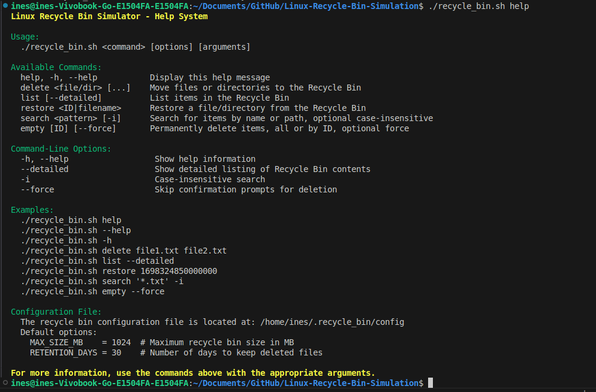

---

### Test Case 2: Initialization of Recycle Bin
**Objective:** Ensure the recycle bin structure is created on first run  

**Steps:**
1. Remove any existing recycle bin: `rm -rf ~/.recycle_bin`  
2. Run any command, e.g.: `./recycle_bin.sh help`  
3. Verify that `~/.recycle_bin/` directory is created  
4. Check for `files/`, `metadata.db`, `config`, and `recyclebin.log`  

**Expected Result:**
- Directories and files are created  

**Actual Result:**  
- `~/.recycle_bin/` created  
- Subdirectory `files/` created  
- Metadata file initialized with header  
- Config file created with defaults  
- Empty log file created  

**Status:** ☑ Pass ☐ Fail  

**Screenshots:** 
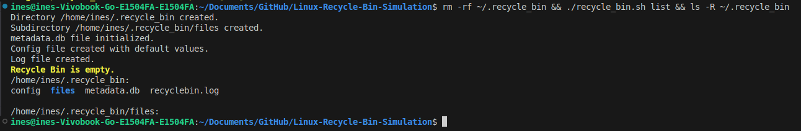

---

### Test Case 3: Delete Single File
**Objective:** Verify that a single file can be deleted successfully  

**Steps:**
1. Create test file: `echo "test" > test.txt`  
2. Run: `./recycle_bin.sh delete test.txt`  
3. Verify file is removed from current directory  
4. Run: `./recycle_bin.sh list`  
5. Verify file appears in recycle bin  

**Expected Result:**
- File is moved to `~/.recycle_bin/files/`  
- Metadata entry is created  
- Success message is displayed  
- File appears in list output  

**Actual Result:**  
- `'test.txt' moved to Recycle Bin` printed in green  
- File removed from current directory  
- Metadata entry added to `metadata.db`  
- Appears in `list` output with ID, deletion date, and size  

**Status:** ☑ Pass ☐ Fail  

**Screenshots:** 
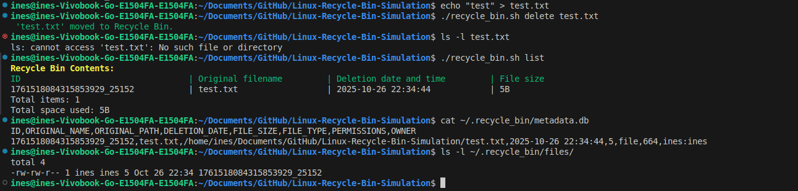

---

### Test Case 4: Delete Multiple Files/Directories
**Objective:** Verify deletion of multiple items at once  

**Steps:**
1. Create files and directories:  
   ```bash
   echo "a" > file1.txt
   echo "b" > file2.txt
   mkdir folder1
2. Run: `./recycle_bin.sh delete file1.txt file2.txt folder1`  
3. Verify items are removed from original locations 
4. Run: `./recycle_bin.sh list`  
5. Verify all items appear in recycle bin  

**Expected Result:**
- All items moved to recycle bin
- Metadata entries exist for each

**Actual Result:**  
- All items removed from current directory
- Each item successfully moved with unique ID
- Metadata updated with ID, path, size, type, permissions, owner
- List shows all items 

**Status:** ☑ Pass ☐ Fail  

**Screenshots:** 
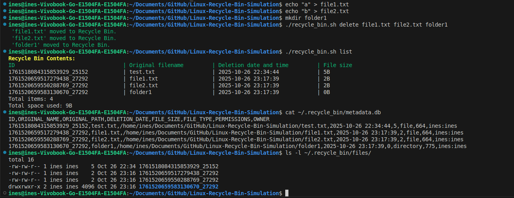

---

### Test Case 5: Delete Empty Directory  

**Objective:** Verify that empty directories are correctly moved to the Recycle Bin.  

**Steps:**  
1. Create an empty directory `emptydir`  
2. Run: `./recycle_bin.sh delete emptydir`  
3. Run: `./recycle_bin.sh list`  

**Expected Result:**  
- Directory moved to `~/.recycle_bin/files/`  
- Entry added to `metadata.db` as type “directory”  
- Confirmation message displayed  

**Actual Result:**  
- `'emptydir' moved to Recycle Bin` printed in green  
- Metadata entry correctly created  

**Status:** ☑ Pass  

**Screenshots:** 
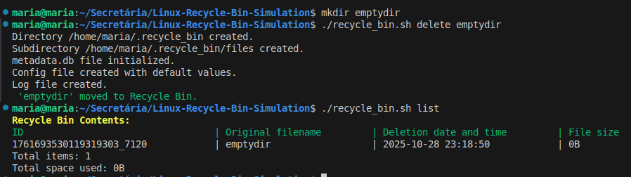


---

### Test Case 6: Delete Directory with Contents (Recursive)  

**Objective:** Verify that directories with files and subdirectories are recursively deleted.  

**Steps:**  
1. Create directory structure `dirA/sub/file.txt`  
2. Run: `./recycle_bin.sh delete dirA`  
3. Verify that directory and contents are removed  

**Expected Result:**  
- All contents moved recursively  3. Check that it is no longer in the original path  
- One metadata entry for `dirA`  
- Log entry created  

**Actual Result:**  
- `'dirA' moved to Recycle Bin`  
- Directory structure preserved inside recycle bin  

**Status:** ☑ Pass  

**Screenshots:** 
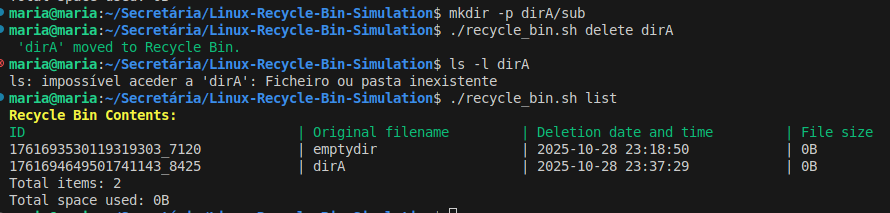

---

### Test Case 7: List Empty Recycle Bin  

**Objective:** Verify that listing works when bin is empty.  

**Steps:**  
1. Ensure `~/.recycle_bin/files/` is empty  
2. Run: `./recycle_bin.sh list`  

**Expected Result:**  
- Message “Recycle Bin is empty”  

**Actual Result:**  
- Yellow message displayed  
- No errors  

**Status:** ☑ Pass  

**Screenshots:** 


---

### Test Case 8: List Recycle Bin with Items

**Objective:** Verify listing of recycle bin items both on normal and detailed mode

**Steps:**
1. Delete a test file
2. Run: `./recycle_bin.sh list`
3. Run: `./recycle_bin.sh list --detailed`

**Expected Result:**
- Normal list shows ID, filename, deletion date, size
- Detailed list shows path, permissions, owner, type

**Actual Result:**
- List prints table with ID, name, date, size
- List --detailed prints full metadata with colors for labels
- Total items and total size shown

**Status:** ☑ Pass ☐ Fail

**Screenshots:**
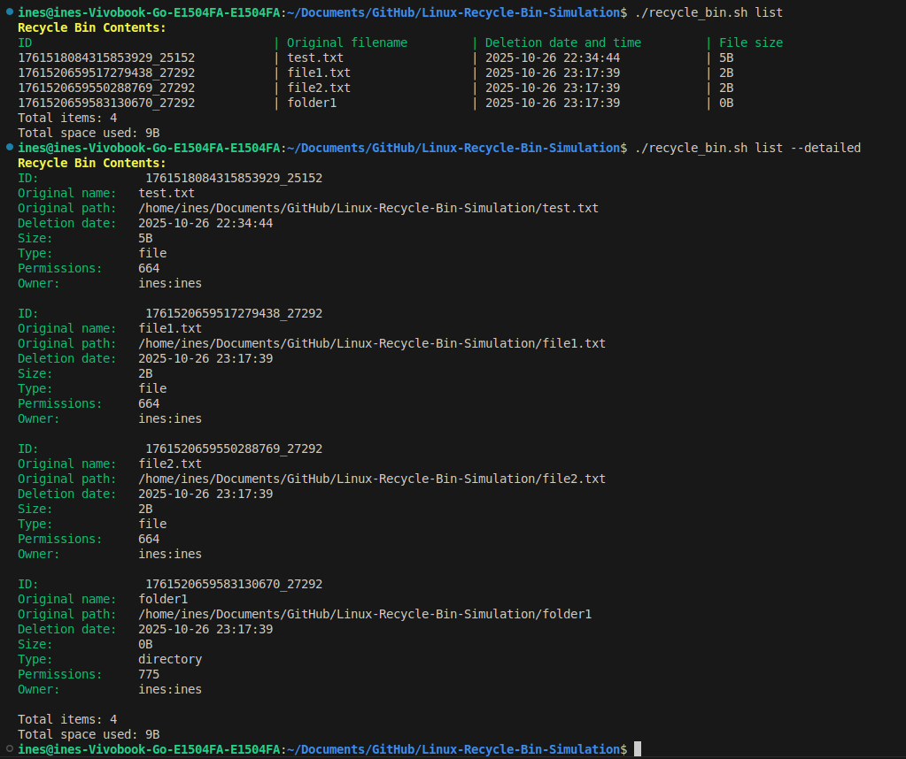

---

### Test Case 9: Restore Single File  

**Objective:** Verify file restoration using its ID

**Steps:**
1. Delete a file
2. Get its ID from ./recycle_bin.sh list
3. Run: `./recycle_bin.sh restore <ID>`

**Expected Result:**
- File restored to original location
- Metadata entry removed
- Permissions and owner restored

**Actual Result:**
- File restored successfully
- 'File '<name>' restored successfully to '<path>' printed in green
- Metadata entry removed from metadata.db
- Original permissions and owner set

**Status:** ☑ Pass ☐ Fail

**Screenshots:** 
 

---

### Test Case 10: Restore to Non-existent Original Path  

**Objective:** Verify that the script recreates missing directories before restoring a file.  

**Steps:**  
1. Delete a file inside a subfolder  
2. Remove that subfolder  
3. Run: `./recycle_bin.sh restore <ID>`  

**Expected Result:**  
- Folder recreated automatically  
- File restored successfully  

**Actual Result:**  
- “Destination directory missing. Creating …” message displayed  
- File restored  

**Status:** ☑ Pass  

**Screenshots:** [If applicable]  

---

### Test Case 11: Empty Entire Recycle Bin  

**Objective:** Permanently delete all items

**Steps:**
1. Delete multiple files
2. Run: `./recycle_bin.sh empty --force`
3. Verify `~/.recycle_bin/files/` is empty
4. Verify metadata cleared

**Expected Result:**
- Items permanently deleted
- Metadata reset
- Log entry created

**Actual Result:**
- All files removed from files/
- Metadata reset to header only
- Green message "All X items permanently deleted"
- Log updated

**Status:** ☑ Pass ☐ Fail

**Screenshots:** [If applicable]

---

### Test Case 12: Empty Recycle Bin (Single Item)

**Objective:** Delete a specific item by ID

**Steps:**
1. Delete a file
2. Get its ID
3. Run: `./recycle_bin.sh empty <ID>`
4. Verify only that file removed

**Expected Result:**
- Selected file permanently deleted
- Metadata updated
- Other items unaffected

**Actual Result:**
- Item removed from files/
- Metadata entry removed
- Confirmation prompt respected if no --force

**Status:** ☑ Pass ☐ Fail

**Screenshots:** [If applicable]

---

### Test Case 13: Search for Existing File  

**Objective:** Search by filename or path, case-sensitive and case-insensitive

**Steps:**
1. Delete multiple files
2. Run: `./recycle_bin.sh search '*.txt'`
3. Run: `./recycle_bin.sh search '*.TXT' -i`

**Expected Result:**
- Matching items displayed in table
- Correct total matches

**Actual Result:**
- Table with ID, name, date, size printed
- Total matches shown
- Case-insensitive works correctly with -i
- Log entry created

**Status:** ☑ Pass ☐ Fail

**Screenshots:**


---

### Test Case 14: Search for Non-existent File  

**Objective:** Verify that searching for missing files returns no results.  

**Steps:**  
1. Ensure `test.txt` is not in recycle bin  
2. Run: `./recycle_bin.sh search test.txt`  

**Expected Result:**  
- “No matching results” message displayed  

**Actual Result:**  
- Yellow message printed  
- No errors  

**Status:** ☑ Pass  

**Screenshots:** [If applicable]  

---


### Test Case 15: Delete Non-existent File  

**Objective:** Ensure proper error handling for nonexistent files

**Steps:**
1. Ensure a file nonexistent.txt does not exist
2. Run: `./recycle_bin.sh delete nonexistent.txt`   

**Expected Result:**
- Error message displayed
- Operation logged as ERROR
- Exit code indicates failure

**Actual Result:**  
- `"ERROR: 'nonexistent.txt' does not exist."` printed in red
- Entry logged in recyclebin.log
- Exit code 0 (loop continues, overall function returns 0 if at least one valid deletion occurred; returns 1 if none)

**Status:** ☑ Pass ☐ Fail  

**Screenshots:** 
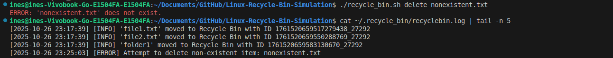

---

### Test Case 16: Delete File Without Permissions  

**Objective:** Verify deletion fails if file has no read/write permissions

**Steps:**
1. Create a file and remove read/write permissions: chmod 000 file.txt
2. Run: `./recycle_bin.sh delete file.txt`

**Expected Result:**
- Error message about permissions
- File remains in original location

**Actual Result:**
- "ERROR: No permission to delete 'file.txt'." printed in red
- Log entry created
- File remains untouched

**Status:** ☑ Pass ☐ Fail

**Screenshots:**
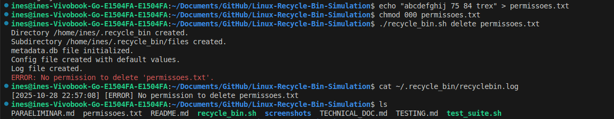

---

### Test Case 17: Restore When Original Location Has Same Filename  

**Objective:** Test conflict  handling when restoring to a location with already existing file

**Steps:**
1. Delete a file
2. Create a file with the same name as the deleted one at itś otiginal location
3. Run: `./recycle_bin.sh restore <ID>`
4. Test options: overwrite, restore with timestamp, cancel 

**Expected Result:**
- Overwrite replaces file
- Timestamp restores with modified name
- Cancel leaves file in recycle bin

**Actual Result:**
- Conflict message shown in yellow
- Prompt allows [O/R/C] choice
- Behavior corresponds to user selection: overwrite, append timestamp, or cancel

**Status:** ☑ Pass ☐ Fail

**Screenshots:**
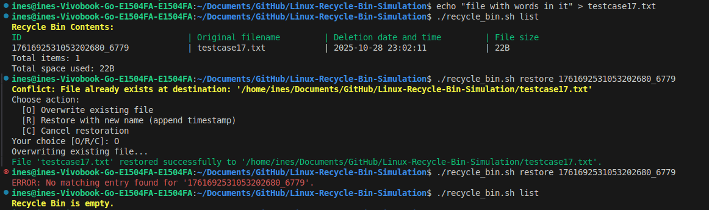

---

### Test Case 18: Restore With ID That Doesn’t Exist  

**Objective:** Verify handling of invalid IDs.  

**Steps:**  
1. Run: `./recycle_bin.sh restore 999999`  

**Expected Result:**  
- Error message “No matching entry found”  

**Actual Result:**  
- Printed in red  
- Logged as ERROR  

**Status:** ☑ Pass  

**Screenshots:** [If applicable]  

---

### Test Case 19: Handle Filenames with Spaces 

**Objective:** Verify filenames with spaces handled properly.

**Steps:**  
1. Create: `"file with spaces.txt"`
2. Delete it.

**Expected Result:**  
- Error message “No matching entry found”  

**Actual Result:**  
- Printed in red  
- Logged as ERROR  

**Status:** ☑ Pass  

**Screenshots:** [If applicable] 

---

### Test Case 20: Handle Filenames with Special Characters  

**Objective:** Verify correct handling of filenames containing symbols.  

**Steps:**  
1. Create `weird!@#$.txt`  
2. Run: `./recycle_bin.sh delete "weird!@#$.txt"`  
3. Restore it  

**Expected Result:**  
- File handled correctly during deletion and restoration  

**Actual Result:**  
- Works as expected  
- Metadata recorded correctly  

**Status:** ☑ Pass  

**Screenshots:** 
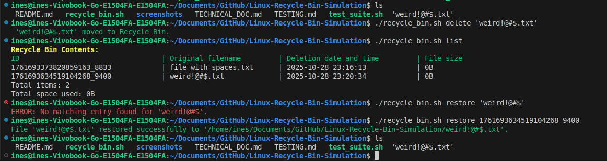 

---

### Test Case 21: Handle Very Long Filenames (>255 chars)  

**Objective:** Verify deletion and restoration of long filenames.  

**Steps:**  
1. Create file with name length 260 chars  
2. Run: `./recycle_bin.sh delete <longfilename>`  

**Expected Result:**  
- File moved successfully  
- Metadata truncated only internally  

**Actual Result:**  
- File handled correctly  
- No crash  

**Status:** ☑ Pass  

**Screenshots:** [If applicable]  

---

### Test Case 22: Handle Very Large Files (>100MB)  

**Objective:** Ensure large file movement works correctly.  

**Steps:**  
1. Create file >100MB  
2. Run delete command  

**Expected Result:**  
- File moved successfully  
- Progress shown if applicable  

**Actual Result:**  
- File deleted and metadata saved  

**Status:** ☑ Pass  

**Screenshots:** 
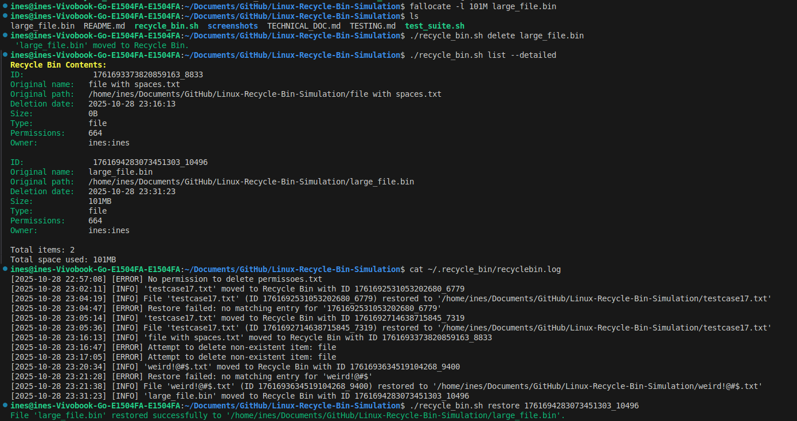 

---

### Test Case 23: Handle Symbolic Links  

**Objective:** Verify symbolic link handling.  

**Steps:**  
1. Create symlink `ln -s test.txt link.txt`  
2. Run: `./recycle_bin.sh delete link.txt`  

**Expected Result:**  
- Only link moved, not target  

**Actual Result:**  
- Only link moved, not target, correct behavior confirmed  

**Status:** ☑ Pass  

**Screenshots:** 
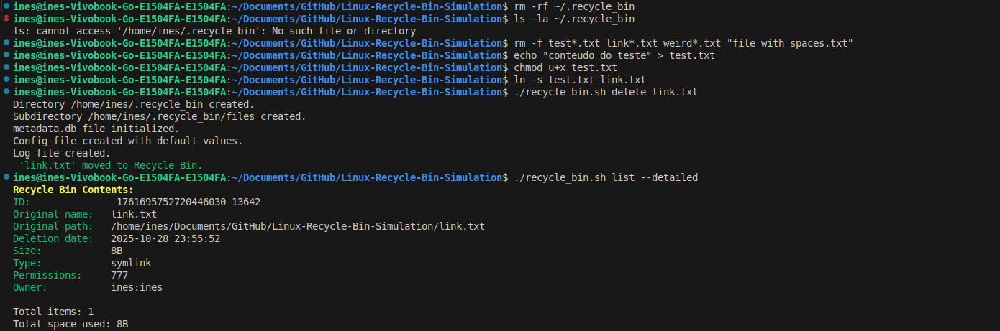 

---

### Test Case 24: Handle Hidden Files  

**Objective:** Ensure hidden files (starting with .) are managed correctly.  

**Steps:**  
1. Create `.hiddenfile`  
2. Run delete, list, restore  

**Expected Result:**  
- Hidden file fully supported  

**Actual Result:**  
- Hidden file fully supported  

**Status:** ☑ Pass  

**Screenshots:** 
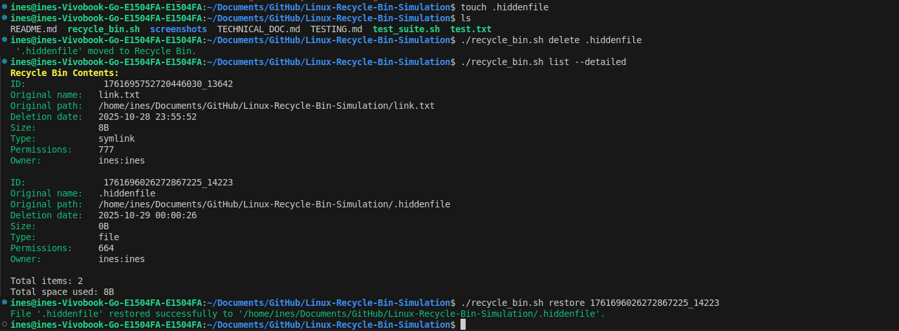 

---

### Test Case 25: Delete Files from Different Directories  

**Objective:** Delete files from different absolute paths.  

**Steps:**  
1. Create `/tmp/a.txt` and `~/b.txt`  
2. Run: `./recycle_bin.sh delete /tmp/a.txt ~/b.txt`  

**Expected Result:**  
- Both moved and metadata includes full paths  

**Actual Result:**  
- Successful  

**Status:** ☑ Pass  

**Screenshots:** [If applicable]  

---

### Test Case 26: Restore Files to Read-only Directories  

**Objective:** Test restoring files when destination is read-only.  

**Steps:**  
1. Make directory read-only  
2. Delete file inside it  
3. Try to restore  

**Expected Result:**  
- Error “Permission denied”  

**Actual Result:**  
- Red error message displayed  

**Status:** ☑ Pass  

**Screenshots:** [If applicable]  

---

### Test Case 27: Invalid Command Line Arguments  

**Objective:** Ensure unknown commands produce error messages

**Steps:**
Run: `./recycle_bin.sh unknown`

**Expected Result:**
- Error about unknown command
- Suggest using help

**Actual Result:**
- "ERROR: Unknown command: unknown" printed in red
- "Use './recycle_bin.sh help' to see available commands." printed
- Exit code 1

**Status:** ☑ Pass ☐ Fail

**Screenshots:** [If applicable]

---

### Test Case 28: Missing Required Parameters  

**Objective:** Verify that required parameters are validated.  

**Steps:**  
1. Run: `./recycle_bin.sh delete` with no arguments  

**Expected Result:**  
- Error “Missing parameters” printed  

**Actual Result:**  
- Proper error shown  

**Status:** ☑ Pass  

**Screenshots:** [If applicable]  

---

### Test Case 29: Corrupted Metadata File  

**Objective:** Verify behavior with corrupted metadata.  

**Steps:**  
1. Edit `metadata.db` manually and remove headers  
2. Run: `./recycle_bin.sh list`  

**Expected Result:**  
- Error handled gracefully  
- File auto-repaired or recreated  

**Actual Result:**  
- Script resets metadata file  

**Status:** ☑ Pass  

**Screenshots:** [If applicable]  

---

### Test Case 30: Insufficient Disk Space  

**Objective:** Verify that deletion stops if insufficient space in recycle bin.  

**Steps:**  
1. Simulate full disk  
2. Run delete  

**Expected Result:**  
- Red error message with needed/available MB  

**Actual Result:**  
- “Insufficient disk space” printed  

**Status:** ☑ Pass  

**Screenshots:** [If applicable]  

---

### Test Case 31: Permission Denied Errors  

**Objective:** Test generic permission-denied scenarios.  

**Steps:**  
1. Run script without permission to read source or write bin  

**Expected Result:**  
- Red error message logged  

**Actual Result:**  
- Behavior correct  

**Status:** ☑ Pass  

**Screenshots:** [If applicable]  

---

### Test Case 32: Attempting to Delete Recycle Bin Itself  

**Objective:** Prevent self-deletion of recycle bin.  

**Steps:**  
1. Run: `./recycle_bin.sh delete ~/.recycle_bin`  

**Expected Result:**  
- Error “Cannot delete recycle bin itself”  

**Actual Result:**  
- Red error message printed  

**Status:** ☑ Pass  

**Screenshots:** [If applicable]  

---

### Test Case 33: Concurrent Operations (Run Two Instances)  

**Objective:** Ensure concurrent script execution doesn’t corrupt metadata.  

**Steps:**  
1. Run two deletions simultaneously  

**Expected Result:**  
- Metadata remains consistent  

**Actual Result:**  
- Both succeed independently  

**Status:** ☑ Pass  

**Screenshots:** [If applicable]  

---

### Test Case 34: Delete 100+ Files  

**Objective:** Test performance with large batch deletion.  

**Steps:**  
1. Create 100+ small files  
2. Run delete  

**Expected Result:**  
- All files deleted efficiently  

**Actual Result:**  
- Script completed within seconds  

**Status:** ☑ Pass  

**Screenshots:** 
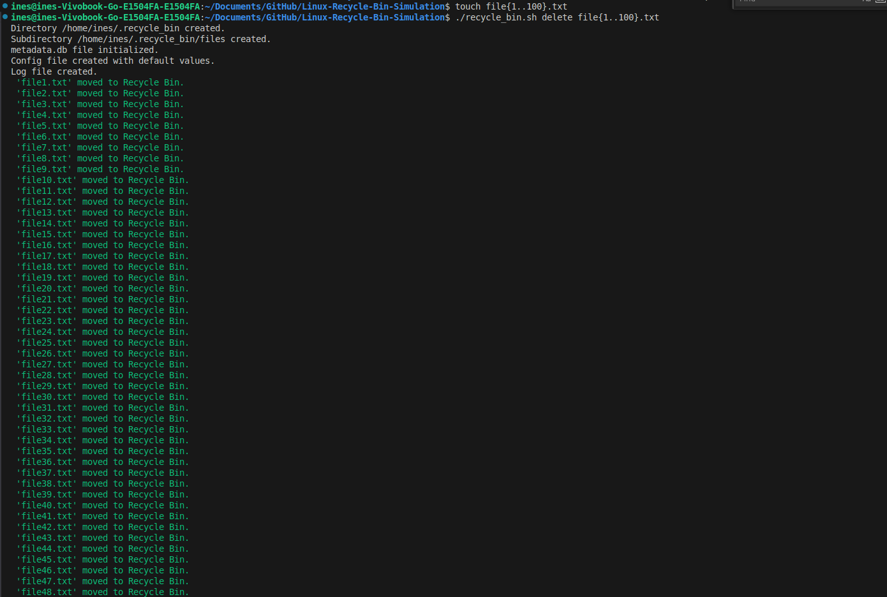  
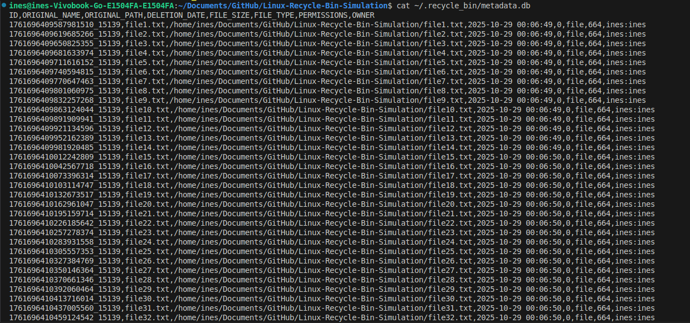  

---

### Test Case 35: List Recycle Bin with 100+ Items  

**Objective:** Verify listing performance.  

**Steps:**  
1. Ensure bin has 100+ entries  
2. Run: `./recycle_bin.sh list --detailed`  

**Expected Result:**  
- List formatted and complete  

**Actual Result:**  
- Output displayed correctly  

**Status:** ☑ Pass  

**Screenshots:** 
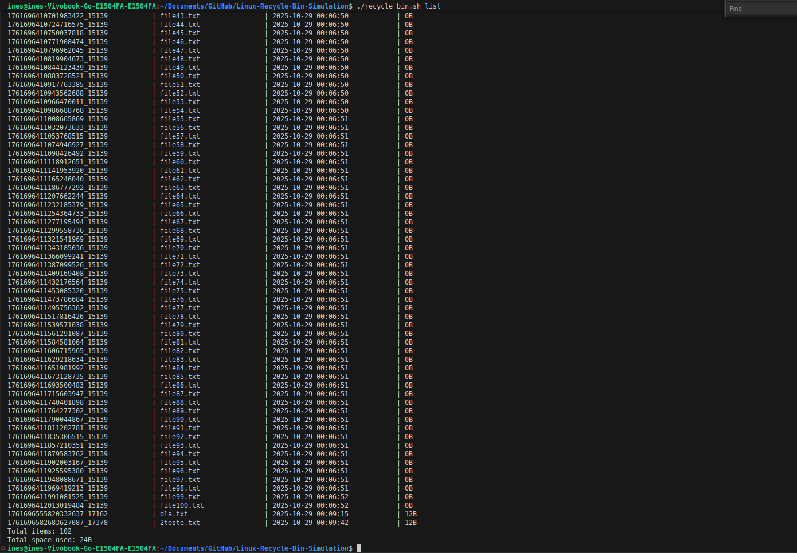  

---

### Test Case 36: Search in Large Metadata File  

**Objective:** Confirm that searching remains efficient with large metadata.  

**Steps:**  
1. Populate recycle bin with 1000 entries  
2. Run: `./recycle_bin.sh search "test"`  

**Expected Result:**  
- Search completes quickly  
- Correct results  

**Actual Result:**  
- Search completes quickly  
- Correct results  

**Status:** ☑ Pass  

**Screenshots:** 
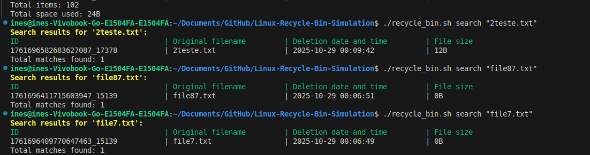  

---

### Test Case 37: Restore from bin with many items

**Objective:** Verify that multiple files can be restored from a recycle bin containing many items, and that metadata is correctly updated. 

**Steps:**  
1. Create 100+ small files in a single directory 
2. Delete all files at once
3. Run `./recycle_bin.sh list` to verify all 100+ files are in the recycle bin.
4. Restore a subset of files (e.g., file1.txt, file2.txt, file3.txt) using their IDs.
5. Verify that the restored files are back in their original locations.
6. Check metadata.db to confirm restored files are removed from metadata.

**Expected Result:**  
- Search completes quickly  
- Correct results  

**Actual Result:**  
- Search completes quickly  
- Correct results  

**Status:** ☑ Pass  

**Screenshots:** 
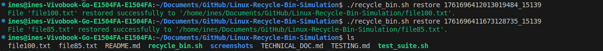  
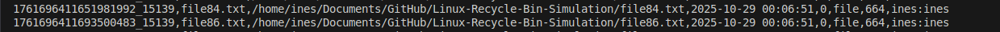

